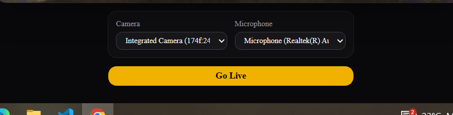

the third div in UI. inside <Main>



```jsx
{
  /* STAGE 5: External Setup Controls */
}
{
  !isMobile && (
    <div className="w-full max-w-sm grid grid-cols-2 gap-3 text-left bg-zinc-900/40 p-3 rounded-xl border border-zinc-800/80 shrink-0">
      <label className="flex flex-col gap-1 text-xs font-medium text-zinc-400">
        Camera
        <select
          onChange={onSelectVideo}
          value={selectedVideoId}
          className="rounded-lg bg-zinc-900 border border-zinc-700 px-2.5 py-1.5 text-xs text-zinc-100 focus:outline-none focus:ring-2 focus:ring-blue-500"
        >
          {videoDevices.map((d) => (
            <option key={d.deviceId} value={d.deviceId}>
              {d.label || `Camera ${d.deviceId.slice(0, 6)}`}
            </option>
          ))}
        </select>
      </label>

      <label className="flex flex-col gap-1 text-xs font-medium text-zinc-400">
        Microphone
        <select
          value={selectedAudioId}
          onChange={onSelectAudio}
          className="rounded-lg bg-zinc-900 border border-zinc-700 px-2.5 py-1.5 text-xs text-zinc-100 focus:outline-none focus:ring-2 focus:ring-blue-500"
        >
          {audioDevices.map((d) => (
            <option key={d.deviceId} value={d.deviceId}>
              {d.label || `Mic ${d.deviceId.slice(0, 6)}`}
            </option>
          ))}
        </select>
      </label>
    </div>
  );
}

<Button
  disabled={loading}
  onClick={handleGoLiveClick}
  className="w-full max-w-sm py-2.5 rounded-xl bg-yellow-500 text-zinc-950 font-bold hover:bg-yellow-400 transition-colors disabled:opacity-50 shrink-0 cursor-pointer"
  type="button"
>
  Go Live
</Button>;
```
